# DISPATCH deep research and Course Forge plan

Status: proposed implementation and quality contract

## The product we are building

DISPATCH should become a local-first research and course-design system that is functionally
competitive with the public experience of ChatGPT Deep Research, Claude Research, Gemini
Deep Research, Perplexity Research, and NotebookLM source-grounded synthesis.

The distinctive VERITY outcome is **Course Forge**: a user supplies one or more courses,
official syllabi, existing plans, grades/diagnostics, available time, deadlines, preferred
resources, and custom instructions. The system researches accessible public material and
the user's sources, reconciles conflicts, constructs a defensible course blueprint, and
proposes a tailored study system in the existing Markdown vault.

It does not pretend to copy private competitor internals. This plan reverse-engineers the
observable research capabilities into an auditable product architecture that fits VERITY's
local-first and approval-only model.

## Public capability target

The system must match these observable patterns, while retaining stronger local evidence and
write safety:

| Public product pattern | Publicly documented behavior | VERITY interpretation |
| --- | --- | --- |
| ChatGPT Deep Research | Plans sub-questions, uses web search and code execution, and returns citation-rich structured research. | Use an explicit research plan, iterative tools, calculations, and a cited final artifact. |
| Claude Research | Performs multiple agentic searches across the web and connected user context, then gives checkable citations. | Let a run explore in stages and use explicitly connected/private sources only with permission. |
| Gemini Deep Research | Lets the user choose sources, edit the research plan, runs in the background, and returns a report. | Put source scope and an editable plan before execution; make a run resumable and observable. |
| Perplexity Research | Iteratively searches, reads, reasons, revises the plan, and exports a comprehensive report. | Treat retrieval, evidence extraction, and synthesis as different states; make outputs reusable course artifacts. |
| NotebookLM | Grounds answers in selected sources with in-line citations that navigate to the supporting location, then generates study artifacts. | Make citations span-level, source-selectable, and use the grounded corpus to produce course maps, study guides, and assessments. |

The linked product documentation is the public behavioral reference, not evidence about
private implementation: [OpenAI Deep Research API](https://developers.openai.com/cookbook/examples/deep_research_api/introduction_to_deep_research_api),
[Claude Research](https://support.anthropic.com/en/articles/11088861-using-research-on-claude-ai),
[Gemini Deep Research](https://support.google.com/gemini/answer/15719111?hl=en),
[Perplexity Research](https://www.perplexity.ai/help-center/en/articles/10738684-what-is-research-mode),
and [NotebookLM source-grounded chat](https://support.google.com/notebooklm/answer/16179559?hl=en).

## The Course Forge promise

A good result is not a giant generic timetable. It is a **living, evidence-backed course
operating system** with a clear answer to four questions:

1. What should this student learn, in what dependency order, and why?
2. Which resources and methods are appropriate for this particular course and learner?
3. What can realistically be completed by the deadline, given actual available time and
   demonstrated starting level?
4. What changes when the student misses work, improves faster, gets a new grade, or changes
   the target?

Course Forge produces a reviewable package:

- a course mandate: target qualification, board/jurisdiction, grade goal, deadline, and
  non-negotiable requirements;
- a normalized competency map with prerequisites, source coverage, and confidence;
- a resource and recommendation dossier with reasons, cost/access constraints, and conflicts;
- a baseline diagnosis from grades, mock results, and student self-report;
- a reverse-engineered calendar from the assessment date back to the available start date;
- weekly milestones, daily executable blocks, practice/feedback cycles, and recovery paths;
- an evidence ledger, limitations, unresolved questions, and alternative scenarios; and
- exact Markdown proposals for the vault, still subject to VERITY's normal review and approval.

The app may recommend; it must never silently replace a student's existing plan, course
files, grades, or schedule.

## Inputs and personalization contract

### Student profile

Create a versioned `LearningProfile`, owned and editable by the user. It contains only what
is useful for planning:

- qualification, subjects, level, board/jurisdiction, language, and target grade;
- start date, assessment dates, blackout dates, recurring availability, weekly capacity, and
  preferred study-block length;
- current grades, diagnostic answers, confidence by topic, accommodation needs, and optional
  teacher feedback;
- preferred and prohibited resource types, budget, access constraints, device/internet
  constraints, and instructional style preferences; and
- custom instructions such as “prioritize proofs,” “do not schedule before school,” or
  “build in weekly review.”

Custom instructions are first-class input, shown in every generated plan, versioned with the
run, and editable. They guide outcomes and style but cannot override source policy, evidence
requirements, budgets, path safety, or the approval gate.

### Source sets

Every input belongs to an explicitly labelled source set:

- **Authority**: official syllabus/specification, assessment policy, curriculum or exam-board
  material. These define required scope.
- **Course corpus**: user-provided courses, textbooks, notes, teacher plans, past papers, and
  accessible course pages. These define available teaching material.
- **Evidence of current level**: grades, marked work, diagnostics, and self-assessment. These
  personalize starting point and pacing; they do not redefine official requirements.
- **Recommendations**: public advice, reviews, communities, and resource lists. These may
  suggest resources but cannot alone establish curriculum facts.
- **Discovery-only**: search results, snippets, or unverified links. They can lead to sources,
  but cannot support a material claim until recorded and inspected.

The user can add URLs, files, folders, or an authorized connector. Public web retrieval is
off until the run's plan identifies it. Private integrations use only the scopes the user
authorizes; no account is connected or crawled implicitly.

## Research and synthesis model

### Durable records

Each run is stored under `Progress/Sessions/<session-id>/research/<run-id>.json` and points
to path-confined source/excerpt files under the same session. The record format is versioned
and independent from the existing chat and proposal formats.

| Record | Essential fields |
| --- | --- |
| `ResearchBrief` | objective, learner profile version, target course, deadline, requested outputs, custom instructions, source policy, budgets |
| `ResearchPlan` | decomposed questions, source coverage targets, planned queries, risks, checkpoints, approval points |
| `SourceRecord` | canonical URL or local reference, publisher/author, dates, source type, access status, content hash, licence/limitation, trust tier |
| `EvidenceSpan` | source ID, stable location/page/heading, excerpt hash, extracted statement, retrieval timestamp |
| `Claim` | statement, claim type, evidence spans, contradiction set, status, confidence rationale, course outputs affected |
| `Competency` | course/topic/skill, prerequisite edges, authority coverage, learner readiness, resource options, assessment links |
| `PlanScenario` | calendar assumptions, capacity, milestones, weekly allocations, risk flags, feasibility result |
| `Recommendation` | resource/method, fit rationale, evidence, cost/access, alternatives, conflicts and uncertainty |
| `CourseBlueprint` | approved competency graph, selected scenario, recommendations, required decisions, generated vault proposal digests |

Store source bodies only when needed to reproduce a citation or user review. Bodies and
attachments are size-limited, content-hashed, confined to the session, and excluded from
diagnostics. The user can inspect and delete each run and its retained source material.

### Claim standard

Every material claim is visibly one of:

- **Verified** — directly supported by a preserved authoritative source.
- **Corroborated** — supported by two or more suitable, independent sources; disagreement is
  disclosed.
- **Tentative** — useful inference or incomplete evidence; it cannot masquerade as a course
  requirement.
- **Unresolved** — conflicting, inaccessible, or insufficient evidence; the app names what
  remains unknown instead of guessing.

Confidence is an explanation of provenance, directness, independence, recency when relevant,
and contradictions—not a model's unsupported self-rating. A citation opens its exact evidence
span or a clear explanation of why only document-level support is available.

## Reverse-engineered research system

```mermaid
flowchart LR
    A["Learning profile and brief"] --> B["Editable research plan"]
    B --> C["Source scout\npublic web + user-authorized corpus"]
    C --> D["Fetcher, extractor, canonicalizer\nand evidence-span store"]
    D --> E["Coverage and contradiction critic"]
    E --> F["Curriculum mapper\ncompetency graph"]
    F --> G["Personalized scheduler\nreverse plan from deadline"]
    G --> H["Synthesis and recommendation critic"]
    H --> I["Evidence board + Course Blueprint review"]
    I --> J["Exact vault proposals\nexplicit approval only"]
```

The stages are actors and typed services, not an uncontrolled swarm. A capable provider may
perform several roles, but every handoff is a validated structured artifact:

1. **Intake and brief critic** converts the request into missing decisions, constraints, and a
   proposed scope. It asks the user only when an answer materially changes the plan.
2. **Research planner** decomposes the work into authority, course-material, learner-level,
   resource, and timeline questions. The user can edit and approve it before collection.
3. **Source scout** performs broad discovery and targeted follow-up. It follows links deeply
   when a source is authoritative or promising, rather than treating search snippets as facts.
4. **Retriever and extractor** fetches allowed content, canonicalizes URLs, validates MIME
   and size, records redirects, extracts text/PDF/OCR with page provenance, and creates
   `EvidenceSpan` records.
5. **Evidence verifier** maps each candidate claim to real spans, checks trust tier, detects
   duplicates, searches for contradiction, and marks missing coverage.
6. **Curriculum mapper** converts overlapping courses and syllabi into a competency graph.
   Authority sources determine required scope; other courses contribute explanations,
   sequencing, and resources without overriding the authority.
7. **Learner modeller** applies grades and diagnostics to the graph. It identifies mastered,
   fragile, unknown, and prerequisite-blocked skills, always showing the evidence used.
8. **Reverse scheduler** works backward from assessments. It assigns capacity-constrained
   teaching, retrieval practice, mixed practice, mock feedback, review, and buffers. A
   deterministic feasibility check catches impossible calendars before prose is generated.
9. **Recommendation critic** challenges resource choices and study methods against learner
   constraints, source support, cost, access, and competing options.
10. **Synthesis editor** creates a citation-rich Course Blueprint, plus structured vault
    proposals. It cannot turn uncertain claims into requirements or change files itself.
11. **Run monitor** shows status, source/turn/byte/time budgets, live limitations, retryable
    failures, cancellation, and resume checkpoints.

## WANDR analysis and evaluation implications

Perplexity describes WANDR as a difficult wide-research benchmark requiring coordinated
search, computation, and reasoning; it reports that even its own system is far from saturated.
The public benchmark release is described as forthcoming, so VERITY must not claim WANDR
scores or bundle it until its tasks, licence, and verifier are actually available. See
[Perplexity's description](https://research.perplexity.ai/articles/rethinking-search-as-code-generation).

The design lesson is nevertheless immediate. Course creation is a wide-and-deep task:
the agent must collect *all* official requirements and usable resources across a broad surface,
then inspect the important evidence deeply enough to justify each item. A beautiful summary
with three sources is a failure if it omits half the required competencies.

Adopt these WANDR-style controls:

- A **coverage matrix** lists every required competency/assessment requirement as a row with
  authority evidence, learner readiness, planned blocks, and verification status.
- A **wide-source ledger** deduplicates candidates, tracks which source classes were searched,
  and identifies unsearched high-value gaps.
- A **row verifier** checks each generated competency/resource/schedule row against evidence
  and deterministic constraints, rather than grading only the final narrative.
- A **compute lane** verifies dates, weekly capacity, prerequisite ordering, grade aggregation,
  and plan feasibility with deterministic code, not model arithmetic.
- An **adversarial critic** looks for copied misinformation, stale specifications, coverage
  holes, recommendation bias, conflicting deadlines, and false precision.

In addition to WANDR when available, evaluate research-report quality with a citation
correctness and effective-citation lens similar to
[DeepResearch Bench](https://arxiv.org/abs/2506.11763), but make VERITY's acceptance tests
course-specific and independently reviewable.

## User experience

### Build a course

From DISPATCH, **Build Course** opens a structured brief instead of a blank chat prompt:

1. Choose or create the learner profile and target course.
2. Add official requirements, current courses/notes, grades or diagnostics, deadline, and
   availability. Pin must-use sources and exclude sources or resource types.
3. Add custom instructions and choose a research depth/budget.
4. Review an editable research plan: questions, source types, expected duration, and what
   data may be accessed. Start only after confirmation.
5. Watch the evidence board fill: sources, coverage matrix, contradictions, claims, and
   progress. Pause, cancel, remove a source, or require more evidence at any time.
6. Review the Course Blueprint: target, map, resources, timeline, weekly plan, risks,
   alternatives, and unresolved questions.
7. Approve only the specific vault proposals wanted. Keep the blueprint as a session artifact
   even if no changes are applied.

### Continuous planning loop

The course is not frozen after first synthesis. New grades, missed sessions, changed
availability, new dates, and user feedback create a new scenario from the old blueprint.
The system highlights what changed, why, and which commitments move. It offers recovery
plans—minimum viable, standard, and stretch—rather than silently repacking a calendar.

### Research notebook behavior

Any normal DISPATCH session can become a source-grounded notebook: select active sources,
ask questions that must stay within them, create cited notes, then promote a validated set of
notes into a Course Forge brief. This is the NotebookLM-like grounded mode; public-web
research stays visibly separate so the user always knows the evidence boundary.

## Architecture and safety

Add a `VerityResearch` package beside `VerityAI`, `VerityVault`, `VerityDomain`, and
`VerityKit`:

| Layer | Responsibilities |
| --- | --- |
| `VerityDomain` | learner/course models, competency graph, planning math, confidence/coverage rules, deterministic feasibility validators |
| `VerityVault` | versioned local records, source/excerpt persistence, migration, atomic coordinated access, user-controlled deletion |
| `VerityResearch` | brief/planning schemas, retrieval, text/PDF/OCR extraction, evidence indexing, provenance, research coordinator, evaluation fixtures |
| `VerityAI` | provider invocation, structured role envelopes, cancellation, bounded output, no-shell policy, model-independent protocols |
| `VerityKit` | run lifecycle, budgets, notifications, course-scenario state, privacy-preserving diagnostics |
| `VERITY` and `VerityDesign` | brief, plan, evidence board, citations, source controls, competency map, scenario comparison, proposal review |

The app owns retrieval/provenance instead of trusting a provider's private browsing trace.
Provider browsing can discover URLs, but a URL supports a claim only after the app records and
extracts it through the same policy-controlled path. Direct requests use an explicit URL,
method, redirect limit, MIME allowlist, byte limit, time limit, and canonical-domain policy.
No provider command is built through a shell string.

The existing invariants remain non-negotiable:

- no provider receives direct vault write authority;
- `VaultProposalApplier` is the sole assistant-originated mutation path;
- each Apply action is bound to exact reviewed content and fresh fingerprints;
- public retrieval respects access controls, terms, robots instructions, rate limits, and
  copyright; no paywall/login bypass;
- external/private source access is explicit, scoped, revocable, and visibly labelled;
- prompts, grades, source bodies, attachments, and credentials stay out of diagnostics and
  telemetry; and
- custom instructions cannot disable any safety, provenance, or approval constraint.

## Delivery sequence and gates

### Phase 0 — generic curriculum foundation

Replace Boards/Competition/IOQM/ZCO assumptions with the versioned vault manifest and generic
course/block schema described in the roadmap. Add neutral vault fixtures plus legacy fixtures.

**Gate:** existing vaults remain no-op byte stable and fully readable; a new user can create a
non-personal curriculum without editing hidden filenames or headers.

### Phase 1 — Course Forge contracts and deterministic planning core

Implement `LearningProfile`, `ResearchBrief`, `Competency`, `PlanScenario`, coverage matrix,
calendar/capacity math, prerequisite validation, and local persistence. Build the brief and
scenario-review UI before web retrieval.

**Gate:** identical inputs produce identical schedule feasibility results; impossible plans are
explicitly rejected or labelled; grades and custom instructions are versioned and never
silently overwrite user data.

### Phase 2 — evidence notebook and course corpus ingestion

Implement sources, excerpts, source selection, citations, local course/PDF/image ingestion,
and a grounded-only Notebook mode. Add span navigation and user-controlled retention/deletion.

**Gate:** every active citation resolves to a local span; an unsupported claim cannot appear as
verified; PDF/OCR pages retain provenance; diagnostic export contains no source body or grade.

### Phase 3 — public deep research engine

Implement editable research plans, app-owned retrieval, source discovery, extraction,
contradiction/coverage work, structured provider envelopes, and resumable/cancellable runs.

**Gate:** malformed provider output is inert; cancellation leaves no orphan process; source,
turn, byte, and deadline limits work; public evidence is distinguished from private corpus.

### Phase 4 — synthesis, recommendations, and vault proposals

Implement competency merging, learner modelling, resource ranking, reverse scheduling, course
blueprint, recovery scenarios, and cited proposal provenance. Make all proposed study content
and plan changes pass the existing review/approval mechanism.

**Gate:** authority coverage is complete or visibly missing; competency graphs are acyclic;
each scheduled block fits capacity and prerequisite order; proposal citations and fingerprints
are fresh at apply time.

### Phase 5 — evaluation, reliability, and release qualification

Create a consented, local evaluation corpus: real-style course requests with official sources,
conflicting plans, stale requirements, incomplete grades, inaccessible pages, recommendation
bias, malicious prompt-injection content, and impossible timelines. Add WANDR tasks once their
public artefacts are available and legally usable.

**Release gate:** pass deterministic coverage/feasibility/security verifiers; meet pre-set
human-review thresholds for citation precision, citation completeness, course coverage,
recommendation transparency, personalization usefulness, and recovery-plan correctness. A
model's prose quality alone can never pass the release gate.

## Definition of done

VERITY reaches this research standard only when a student can give it a real course goal,
existing material, grades, time constraints, and custom instructions; receive an evidence-rich,
feasible course system; inspect the exact support for every important decision; adjust the
assumptions; and approve only the resulting vault changes they want. The system must remain
useful when a source fails, a provider is unavailable, the timeline becomes impossible, or the
student's evidence changes—and it must say what it cannot know.
